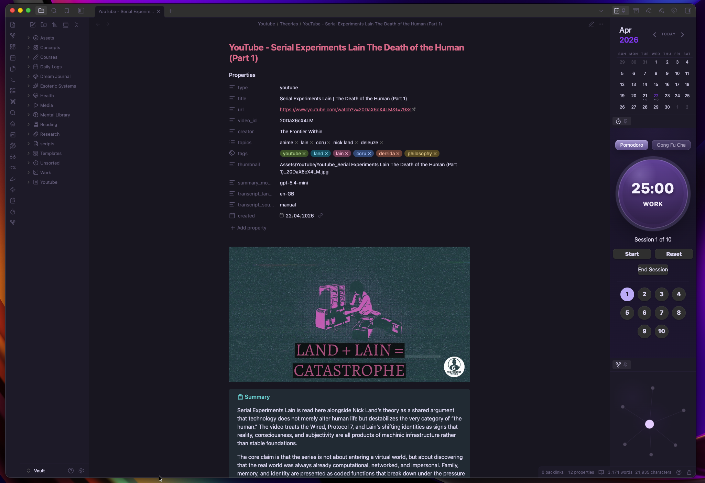

# Obsidian YouTube Capture Workflow

Turn a YouTube link into a clean Obsidian note with:

- properties/frontmatter
- local thumbnail download
- AI-generated summary
- collapsed transcript callout
- notes section for your own writing

This is a workflow setup for Obsidian desktop using QuickAdd, Templater, and a Python helper script. It is not a standalone Obsidian plugin.



## What this is

This project turns a YouTube link into a structured Obsidian note. It uses QuickAdd to trigger the workflow, Templater to generate the note, a Python helper to fetch the thumbnail and transcript, and the OpenAI API to generate a summary.

The result is a note with:

- frontmatter properties
- a local thumbnail
- an open summary callout
- a collapsed transcript callout
- a notes section

## Features

- Create a note from a YouTube URL
- Save the thumbnail locally in the vault
- Generate an AI summary with the OpenAI API
- Insert a collapsed transcript callout
- Add structured frontmatter/properties
- Create a clean notes section for manual annotations

## Requirements

- Obsidian desktop
- QuickAdd plugin
- Templater plugin
- Python 3.9+
- OpenAI API key

## Installation

### 1. Install community plugins

Enable and install:

- QuickAdd
- Templater

### 2. Create folders in your vault

Create these folders:

- `Templates`
- `scripts`
- `Assets/YouTube`
- `Notes/YouTube`

### 3. Copy these files into your vault

- `Templates/YouTube Note.md` → `Templates/`
- `scripts/youtube_helper.py` → `scripts/`
- `scripts/youtube_note.js` → `scripts/`

### 4. Install Python packages

```bash
python3 -m pip install requests youtube-transcript-api openai
```

### 5. Add your API key

Create a file at:

```text
scripts/.env
```

Add:

```bash
OPENAI_API_KEY=your_key_here
YOUTUBE_SUMMARY_MODEL=gpt-5.4-mini
```

### 6. Configure Templater

Set:

- Template folder location: `Templates`
- User Script Functions folder: `scripts`

Also enable:

- `Trigger Templater on new file creation`

### 7. Configure QuickAdd

Create a **Template** choice with:

- Name: `YouTube Note`
- Template Path: `Templates/YouTube Note.md`

## Usage

Run the `YouTube Note` QuickAdd command and paste a YouTube URL.

The workflow will:

1. create a note
2. fetch the thumbnail
3. fetch the transcript
4. generate an AI summary
5. insert everything into a structured Obsidian note

## Output structure

Each generated note includes:

- frontmatter/properties
- thumbnail image
- open Summary callout
- collapsed Transcript callout
- Notes section

## Notes

- Transcript extraction depends on public transcript availability.
- This workflow is desktop-only.
- This is not an official Obsidian plugin.
- An OpenAI API key is required for AI summaries.

## Troubleshooting

### Summary says `TODO`

Usually this means the OpenAI API key was not found or could not be used.

Check:

- `scripts/.env` exists
- `OPENAI_API_KEY` is valid
- `openai` is installed in the same Python environment used by Obsidian

### Transcript is unavailable

Some videos do not expose transcripts, and some transcript fetches fail even when the video has captions.

### Raw templater code appears in the note

Make sure Templater is configured correctly and that `Trigger Templater on new file creation` is enabled.

## License

MIT
Release Notes
# v1.0.0 — Initial public release

Initial public release of the Obsidian YouTube capture workflow.

## Features

- Create a note from a YouTube URL
- Save the thumbnail locally in the vault
- Generate an AI summary with the OpenAI API
- Insert a collapsed transcript callout
- Add structured frontmatter/properties
- Create a clean notes section for manual annotations

## Built with

- Obsidian
- QuickAdd
- Templater
- Python
- youtube-transcript-api
- OpenAI API


